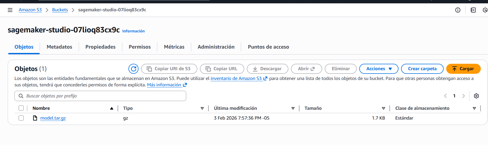
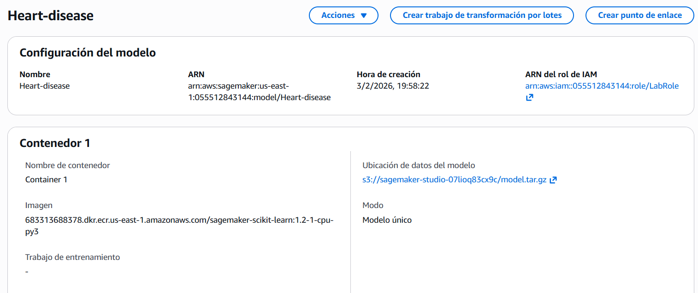
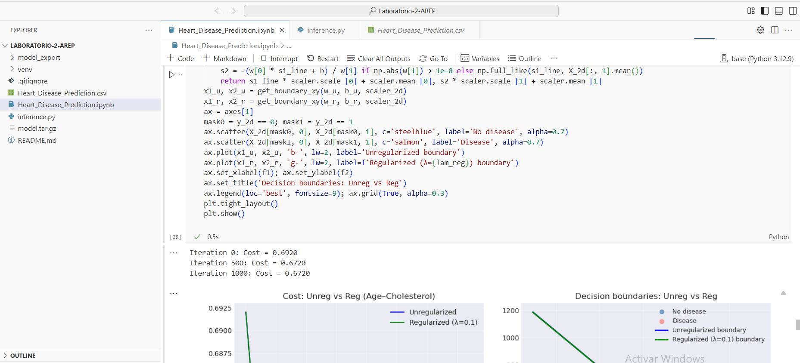
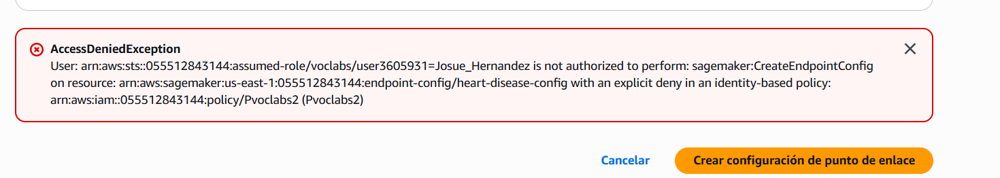

# Heart Disease Risk Prediction: Logistic Regression

## Overview
Implementation of **logistic regression from scratch** (without using sklearn’s LogisticRegression) to predict heart disease risk from clinical features. The notebook covers data preparation, model training, evaluation, 2D decision-boundary visualization, and L2 regularization with λ tuning.

## Dataset
- **Source**: Heart Disease Prediction Dataset (Kaggle)
- **Samples**: 270 records
- **Features**: 6 selected features (Age, Cholesterol, BP, Max HR, ST depression, Number of vessels fluro)
- **Target**: Binary classification (Presence → 1, Absence → 0)

## Requirements
```
numpy
pandas
matplotlib
seaborn
scikit-learn
jupyter
```

## Usage
1. Open `Heart_Disease_Prediction.ipynb` in Jupyter Notebook or JupyterLab.
2. Run all cells in order (Run All or run step by step).

---

## What the notebook does

### Step 1: Load and Prepare the Dataset
- Load the dataset and inspect shape, columns, and first rows.
- Binarize the target: Presence → 1, Absence → 0.
- **Exploratory Data Analysis (EDA)**:
  - Class distribution (bar chart).
  - Feature distributions by class (e.g. Age, Cholesterol, BP by heart disease).
  - Correlation matrix heatmap.
- **Feature selection**: Use 6 numerical features (Age, Cholesterol, BP, Max HR, ST depression, Number of vessels fluro) and build the design matrix **X** and target vector **y**.

### Step 2: Implement Basic Logistic Regression
- **Sigmoid function**: σ(z) = 1/(1+e^(-z)), with clipping for numerical stability.
- **Cost function**: Binary cross-entropy (log loss).
- **Gradients**: Analytic gradients for weights and bias (no L2 here).
- **Gradient descent**: Iterative optimization with cost logged every 100 iterations.
- **Training**:
  - Stratified 70/30 train/test split.
  - StandardScaler on training data; same scaler on test.
  - Weights and bias initialized to zero; learning rate 0.01, 2000 iterations.
- **Predictions**: Threshold 0.5 on probability; compute train and test predictions.
- **Evaluation**: Accuracy, precision, recall, F1, confusion matrix (train and test).
- **Cost plot**: Cost vs iteration showing convergence.
- **Feature weights (coefficients)**: Bar plot of learned weights; red = increase in cardiac risk, green = decrease; interpretation in markdown.

### Step 3: Visualize Decision Boundaries
- **≥3 feature pairs** (e.g. Age–Cholesterol, BP–Max HR, ST depression–Number of vessels fluro).
- For each pair:
  - Subset data to 2D, split and scale.
  - Train a 2D logistic regression (same gradient descent as Step 2).
  - Plot **decision boundary line** and **scatter of points with true labels** (No disease / Disease).
- **Reporting**: At least 3 plots (one per pair).
- **Markdown**: Short **insights per pair** on separability and linearity (e.g. “Clear divide at chol>250”, overlap, need for more features or nonlinearity).

### Step 4: Repeat with Regularization
- **L2 regularization**:
  - Cost: add (λ/2m)‖w‖²; gradients: dw += (λ/m)w.
  - New functions in the notebook only: `compute_cost_l2`, `compute_gradients_l2`, `gradient_descent_l2` (Step 2 code is unchanged).
- **Tune λ**: Values [0, 0.001, 0.01, 0.1, 1]; for each λ, retrain the **full model** (6 features) and record Acc_train, Acc_test, ‖w‖.
- **λ–metrics table**: Printed table with λ, Acc_train, Acc_test, ‖w‖.
- **Optimal λ**: Code selects the λ with best test accuracy and prints a line like: *“Optimal λ=[val] improves Acc_test by [val]%.”*
- **One 2D pair (e.g. Age–Cholesterol)**:
  - Train **unregularized** (λ=0) and **regularized** (e.g. λ=0.1).
  - **Plots**: (1) Cost vs iteration (unreg vs reg); (2) Decision boundaries (unreg vs reg) with scatter of true labels.
- **Markdown**: Short summary of reporting and the “Optimal λ improves [metric] by [val]%” conclusion; note that smaller ‖w‖ with regularization indicates smaller coefficients and less overfitting.

### Step 5: SageMaker Deployment Attempt
- I attempted to deploy the model to **AWS SageMaker**:
  1. **Export**: I export model artifacts (weights `w`, bias `b`, scaler, and feature list) to `model_export/`.
  2. **Package**: I package the inference script (`inference.py`) together with those artifacts into `model.tar.gz` in the format SageMaker expects (folder `code/` with `inference.py` and model files).
  3. **Upload to S3**: I upload the `model.tar.gz` file to an S3 bucket and register the model in SageMaker with the scikit-learn container image and artifact location.

  

  
  
  I only uploaded the notebook in SageMaker Studio without any endpoint.
  
  

- **Result**: **I could not complete the deployment due to insufficient permissions**. When I tried to create the endpoint configuration in the SageMaker console, the lab IAM policy explicitly denied the action `sagemaker:CreateEndpointConfig`.

  

